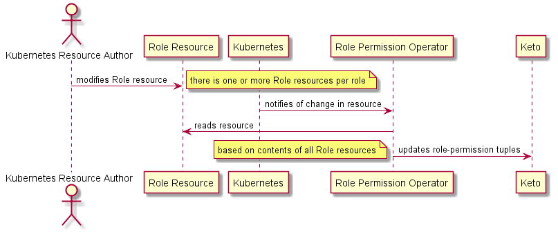

## Mojaloop Role Permission Operator (For K8S)
[](https://github.com/mojaloop/security-role-perm-operator-svc/commits/master)
[](https://github.com/mojaloop/security-role-perm-operator-svc/releases)
[](https://circleci.com/gh/mojaloop/security-role-perm-operator-svc)

## Introduction

This is a kubernetes operator which is a part of the [Business Operations Framework](https://docs.mojaloop.io/mojaloop-business-docs/).

The **kubernetes role-permission operator** is the service that will monitor the [custom k8s resources](https://kubernetes.io/docs/tasks/extend-kubernetes/custom-resources/custom-resource-definitions/) (Ex: 'MojaloopRole'), and update Keto to affect the assignments.

The service aggregates the permissions based on all the custom resources and update tuples in Ory Keto service.

Here is an example of a role resource file:
```yml
apiVersion: "mojaloop.io/v1"
kind: MojaloopRole
metadata:
  name: arbitrary-name-here
spec:
  # must match what it is used in Keto, whatever that is
  role: RoleIdentifier
  permissions:
  - permission_01
  - permission_02
  - permission_03
  - permission_04'
```
This sequence digram illustrates how Ory Keto is updated.

 

Note: This service needs to be deployed in kubernetes as a standard deployment with special permissions using [Kubernetes Service Accounts](https://kubernetes.io/docs/tasks/configure-pod-container/configure-service-account/)

Refer the sample K8S resource files in resources folder.


## Runtime Configuration

Runtime configuration is handled by `rc`, and can be specified using either Environment Variables, or a `.json` file.

See [`./config/default.json`](./config/default.json) for an example config file.

When setting configuration using environment variables, the `ROLE_PERM_OPERATOR` environment variable prefix is required.

For example to set a configuration variable 'ORY_KETO_READ_SERVICE_URL', we need to pass the environment variable like this `ROLE_PERM_OPERATOR_ORY_KETO_READ_SERVICE_URL`.

See [`src/shared/config.ts`](src/shared/config.ts) to understand how these variables are configured.

### Key Config Options

| Variable Name | Description | Default Value |
| -------------------- | ----------- | ------ |
| ROLE_PERMISSION_OPERATOR.WATCH_RESOURCE_GROUP | K8S resource group name | mojaloop.io
| ROLE_PERMISSION_OPERATOR.WATCH_RESOURCE_VERSION | K8S resource version | v1
| ROLE_PERMISSION_OPERATOR.WATCH_RESOURCE_PLURAL | K8S resource plural | mojalooproles
| PERMISSION_EXCLUSIONS_OPERATOR.WATCH_RESOURCE_GROUP | K8S resource group name | mojaloop.io
| PERMISSION_EXCLUSIONS_OPERATOR.WATCH_RESOURCE_VERSION | K8S resource version | v1
| PERMISSION_EXCLUSIONS_OPERATOR.WATCH_RESOURCE_PLURAL | K8S resource plural | mojaloop-permission-exclusions
| WATCH_NAMESPACE | K8S namespace | mojaloop
| ORY_KETO_READ_SERVICE_URL | Keto service read URL | http://localhost:4466
| ORY_KETO_WRITE_SERVICE_URL | Keto service write URL | http://localhost:4467
| KETO_QUEUE_PROCESS_INTERVAL_MS | Frequency to check the messages to be updated to Keto | 1000

> ***Note:** See [`./config/default.json`](./config/default.json) for all available config options, and their default values.*

## Setup for developer

> ***Note:** We are going to run the service locally instead of in K8S. So we don't need service accounts and permissions to access K8S apis from our service. We already have access to K8S with minikube kubeconfig*

### Clone repo
```bash
git clone git@github.com:mojaloop/security-role-perm-operator-svc.git
```

### Install service dependencies
```bash
cd security-role-perm-operator-svc
npm ci
```

### Install and start minikube
```bash
minikube start
```

### Deploy the namespace and CRD in K8S
```bash
kubectl apply -f resources/mojaloop-namespace.yaml
kubectl -n mojaloop apply -f resources/mojalooprole-crd.yaml
```

### Start the keto docker service
```bash
cd keto
docker-compose up -d
```

### Run the service with NPM locally (Connects with the current K8S context in the local machine)
```bash
npm run startDev
```

### Add couple of K8S custom resources and observe the change in keto tuples
```bash
kubectl apply -f resources/mojalooprole-sample1.yaml
sleep 2000

curl --location --request GET 'http://localhost:4466/relation-tuples?namespace=permission'

kubectl apply -f resources/mojalooprole-sample2.yaml
sleep 2000

curl --location --request GET 'http://localhost:4466/relation-tuples?namespace=permission'
```

### Clean up
```bash
kubectl -n mojaloop delete -f resources/mojalooprole-crd.yaml
kubectl delete -f resources/mojaloop-namespace.yaml
cd keto
docker-compose down
```

## Deployment in K8S

The service can be tested by deploying in K8S with the following commands.

```
sh script-minikube-docker-build.sh
sh script-k8s-resource-apply.sh
```